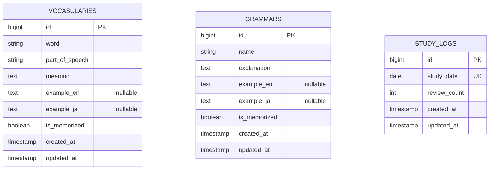

# VocaReview データベース設計

`README.md`（要件定義書）と `CLAUDE.md`、および共有されたUIモックアップをもとに設計したデータベース仕様。
実装済みの Migration（`database/migrations/2026_08_02_*_create_*_table.php`）・Model（`app/Models/Vocabulary.php`, `Grammar.php`, `StudyLog.php`）・Enum（`app/Enums/PartOfSpeech.php`）に対応する。

## 設計方針

- 要件定義書 §5 で「単語・フレーズ」「文法」「学習記録」がそれぞれ独立した項目として定義されているため、**3つのテーブルに分割**する（`vocabularies` / `grammars` / `study_logs`）。
- UIモックアップの一覧テーブルは単語と文法を1つの表にまとめて表示しているが、これは**表示（コントローラー側）でのマージ**として扱い、テーブル自体は正規化した状態を保つ。単語と文法は列構成が異なる（品詞の有無など）ため、無理に1テーブルへ統合すると NULL 許容列が増え、Eloquent のモデルも曖昧になる。
- テストは SQLite（`:memory:`）、本番/開発は MySQL で動くため（`CLAUDE.md` 参照）、MySQL固有の型（ネイティブ `ENUM` など）は使わず、両DBで共通に使える型のみを使用する。

## ER図

`vocabularies` と `grammars` の間、および `study_logs` との間に外部キー関係はない。学習記録は「その日に何件復習したか」という集計値のみを持ち、個々の単語・文法とは直接紐付けない（要件定義書 §5 の学習記録の項目に外部キーの定義がないため）。

## テーブル定義

### `vocabularies`（単語・フレーズ）

| カラム | 型 | NULL | 説明 |
|---|---|---|---|
| id | bigint unsigned (PK) | NO | |
| word | varchar(255), index | NO | 英単語・フレーズ |
| part_of_speech | varchar(50) | NO | 品詞。`App\Enums\PartOfSpeech`（8種）にキャストされる文字列値 |
| meaning | text | NO | 意味 |
| example_en | text | YES | 例文（英語）。登録フォームで必須マーク(*)が無いため任意項目 |
| example_ja | text | YES | 例文（日本語）。同上、任意項目 |
| is_memorized | boolean, index, default false | NO | 覚えた／未習得 |
| created_at / updated_at | timestamp | YES | |

**品詞について**: モックアップの登録フォームでは「Noun (名詞)」のようにプルダウンから選択する。DBネイティブの `ENUM` 型は MySQL と SQLite で挙動が異なり移植性に欠けるため、`varchar(50)` に文字列（`noun`, `verb`, ...）を保存し、`App\Enums\PartOfSpeech`（PHP Backed Enum）でアプリ側の型安全性とラベル表示（`label()` メソッド）を担保する設計にした。

### `grammars`（文法）

| カラム | 型 | NULL | 説明 |
|---|---|---|---|
| id | bigint unsigned (PK) | NO | |
| name | varchar(255), index | NO | 文法名 |
| explanation | text | NO | 解説 |
| example_en | text | YES | 例文（英語）。任意項目 |
| example_ja | text | YES | 例文（日本語）。任意項目 |
| is_memorized | boolean, index, default false | NO | 覚えた／未習得 |
| created_at / updated_at | timestamp | YES | |

### `study_logs`（学習記録）

| カラム | 型 | NULL | 説明 |
|---|---|---|---|
| id | bigint unsigned (PK) | NO | |
| study_date | date, unique | NO | 学習日（1日1レコード） |
| review_count | int unsigned, default 0 | NO | その日の復習数 |
| created_at / updated_at | timestamp | YES | |

**運用イメージ**: 復習操作（単語・文法カードのレビュー）が行われるたびに、当日の `study_date` を持つレコードを `firstOrCreate` し `review_count` をインクリメントする想定。ヘッダーに表示する4つの指標は、この単一テーブルから以下のように導出できるため、追加の集計カラムは持たない。

| ヘッダー表示 | 導出方法 |
|---|---|
| 今日の復習数（例: 35/100） | `study_date = 今日` の `review_count`（レコードが無ければ0） |
| 連続学習日数（例: 12日） | `study_date` 降順に、日付が1日ずつ連続している間カウント |
| 総復習回数（例: 1,245件） | 全レコードの `review_count` の `SUM` |
| 最終学習日（例: 2024/05/20） | `MAX(study_date)` |

これらの集計ロジックは Controller / Service 層の実装時（次のステップ）に扱う。

## インデックス方針

- `vocabularies.word` / `grammars.name`: 一覧の検索・並び替え（要件定義書 §2機能1）で頻繁に参照されるため単純indexを付与。
- `vocabularies.is_memorized` / `grammars.is_memorized`: 復習機能（§機能4）の「覚えた／覚えていない」絞り込みで `WHERE` 条件に使われるため付与。
- `study_logs.study_date`: 一意制約（unique）が実質的にindexを兼ねる。日付範囲検索・`MAX()`・連続日数計算に利用。

## バリデーション方針（実装時にFormRequestで担保）

要件定義書 §8「必須項目は未入力で登録できないようにする」に基づき、DBのNOT NULL制約と合わせて以下をアプリ層で検証する想定。

- `vocabularies`: `word`, `part_of_speech`（8種のいずれか）, `meaning` は必須。`example_en`, `example_ja` は任意。
- `grammars`: `name`, `explanation` は必須。`example_en`, `example_ja` は任意。
- 文字数制限は要件定義書に明記がないため未設定（実装時に必要に応じて追加）。

## 未実装（今回のスコープ外）

- Controller / Route（`Route::resource`）
- Blade View
- Factory / Seeder（テストデータ投入用）
- 学習記録の集計ロジック（連続日数計算など）の実装

Migration・Model・Enum の実体は以下の通り。

- `database/migrations/2026_08_02_122056_create_vocabularies_table.php`
- `database/migrations/2026_08_02_122057_create_grammars_table.php`
- `database/migrations/2026_08_02_122058_create_study_logs_table.php`
- `app/Models/Vocabulary.php`
- `app/Models/Grammar.php`
- `app/Models/StudyLog.php`
- `app/Enums/PartOfSpeech.php`
